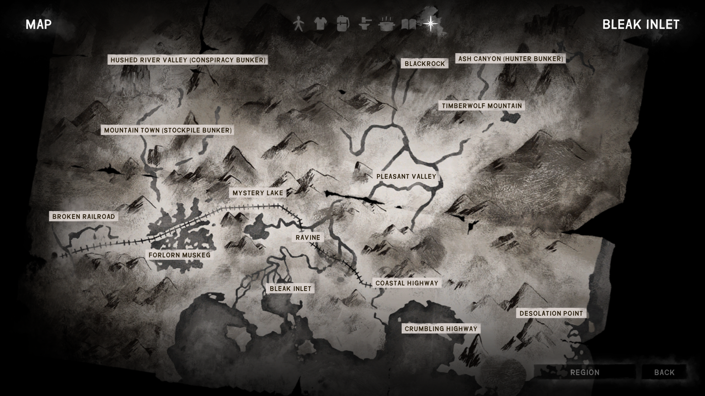

# PrepperCache

### What is it?

This project is a MelonLoader-based mod for [The Long Dark](https://www.thelongdark.com).
A video game developed by [Hinterland Games](https://hinterlandgames.com/).

It provides information about the random prepper cache locations for the current game.  
This can be useful for players who want to find these caches without having to search for them manually.
For more difficult experience modes like Interloper and Misery, this can be a significant time saver and reduce 
frustration for players who are trying to find these caches.

### Features

Provides access to prepper cache information for the current game.

The data is written to a text file (PrepperCache.log) located in the game's Mods folder.
The log file is updated when the player presses the configured hotkey (default: Numeric Keypad 4).
The data is written as a single row of "|" separated values, with the following columns:
   - **irlDateTime**: Real-world date and time when the data was recorded (MM/DD/YYYY HH:MM:SS)
   - **gameTime**: In-game hours played (float)
   - **experienceMode**: Experience mode for this game (Pilgrim, Voyageur, etc)
   - **gameName**: User name for this game
   - The next 4 fields are repeated 9 times and show the random prepper cache name mapped to the region it appears in:
      - **bunkerNumber.m_Interior.name**: Bunker interior name
      - **bunkerNumber.m_Interior.name**: User-friendly bunker interior name
      - **bunkerNumber.m_LocationReference.SceneName**: Name of the scene for this replacement bunker
      - **bunkerNumber.m_LocationReference.SceneName**: User-friendly name of the scene for this replacement bunker
   - **triggerCode**: Code indicating what triggered the data capture (K=Keypress)

Example World Map with prepper cache annotations.

### Options

The mod includes configurable options that can be adjusted through a settings menu in-game.

- **Enable Prepper Cache data capture (Yes/No)** - Enable or disable the mod's data logging function.
- **Capture Prepper Cache Key** - Configure the hotkey used to trigger the data capture. Default is Numeric Keypad 1.
- **Enable HUD display messages (Yes/No)** - Enable or disable messages displayed on the HUD when data is captured.
- **HUD Prepper Cache Inventory display duration (seconds)** - Configure how long the HUD messages are displayed when data is captured.
- **Enable World Map Prepper Cache Inventory Display** - Enable or disable the display of prepper cache information on the world map.

### Installation

<!-- >- **Install** [[ModSettings](https://github.com/DigitalzombieTLD/ModSettings/releases/tag/v2.0)] **and it's dependencies.** -->
- **Install** [[ModSettings](https://github.com/DigitalzombieTLD/ModSettings/releases/latest)] **and it's dependencies.**
- **Drop the** **.dll** **file into your mods folder**.
- **Enjoy**!